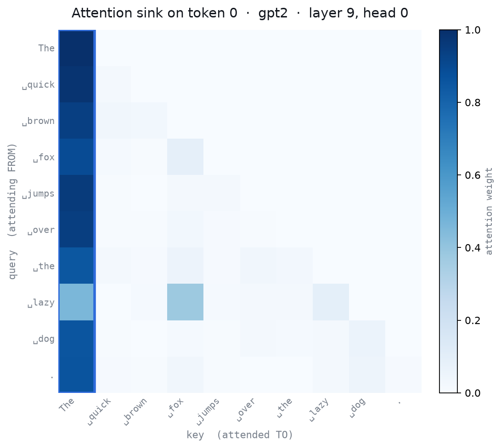

# Attention Sink Playground

**Type a sentence and watch a language model pour a huge share of its attention onto the very first token — then break it on purpose and learn why it's a feature, not a bug.**

An interactive [marimo](https://marimo.io) notebook that turns the central claim of
[*"Why do LLMs attend to the first token?"* (Barbero et al., 2025)](https://arxiv.org/abs/2504.02732)
into something you can see, poke, and break.



> Layer 9, head 0 of GPT-2 on *"The quick brown fox jumps over the lazy dog."* Almost every token, whatever its job, sends most of its attention back to token 0.

---

## ▶ Open in molab

**[Open the live notebook in molab](https://molab.marimo.io/notebooks/nb_3YFUCgvV9Pf9JPL24upDYw)** — click **Run it now** to launch the interactive version.

Built for the **alphaXiv × marimo "Bring Research to Life" molab Notebook Competition #2.**

---

## The paper, in one sentence

LLMs reliably dump attention on the first token ("attention sinks"). Barbero et al. show **why**: the sink is a learned defense against *over-mixing* — without somewhere to park spare attention, token representations blur into each other across depth (rank/representational collapse). The first token acts as a near-empty "parking spot" so the tokens that matter stay distinct.

## What the notebook does

A guided, top-to-bottom explorable. By the end you can explain — in your own words — what a token is, what attention is, what an attention sink is, why the first token attracts so much of it, and why that matters.

- **Tokenized prompt strip** — see exactly how your text splits into tokens (the first token is *not* the first letter).
- **Live attention heatmap** — hover any cell for the exact weight; watch the first column glow.
- **Attention-received bar chart + headline %, with a plain-English verdict** — the first-token spike, made undeniable, and a one-line read on how hard *your* sentence sinks.
- **Layer-wise sink curve with ▶ play depth** — drag the layer slider or hit autoplay and watch the sink, the heatmap, and the collapse plots all strengthen with depth together.
- **Collapse scatter (2-D) + an orbitable 3-D point cloud** — watch the content tokens' representations literally pull into a single clump as depth grows (over-mixing made visible); the 3-D view (three.js) lets you spin and scrub it.
- **Over-mixing meter** — the sink and representational collapse plotted together, climbing in lock-step with depth.
- **"Break the first token" experiment + leaderboard** — run six prompt variants (repetition, length, punctuation-first…) and see where *your* sentence ranks among them.
- **Model-size comparison** — DistilGPT-2 (6 layers) vs GPT-2 (12), showing deeper models sink harder (extends to `gpt2-large`/`gpt2-xl` on a GPU).

Inference is **gated behind a Run button** and the model is **cached**, so dragging a slider updates the visuals instantly — it feels like a playground, not a laggy form.

## How to run

**In molab (easiest):** open the link above. To edit a copy, click *Edit* in molab, or locally run `marimo edit <molab-url>`.

**Locally:**

```bash
# uv (recommended — reads the inline PEP 723 deps in notebook.py)
uvx marimo edit --sandbox notebook.py

# or pip
pip install marimo torch transformers altair pandas numpy
marimo edit notebook.py      # edit mode
marimo run notebook.py       # app (read-only) mode
```

First run downloads GPT-2 (~500 MB) from the Hugging Face Hub. CPU is fine for the core notebook; a GPU is only needed for the model-size comparison.

## Models & the one critical gotcha

Defaults to small, **ungated** causal LMs that expose attention weights: `gpt2` (default), `distilgpt2`, and the Pythia family. Gated models (Llama, Gemma) are discussed but not in the default path — they add auth friction that can break a live demo.

> **Models must be loaded with `attn_implementation="eager"`.** Modern `transformers` defaults to SDPA/Flash attention, which return `None` for attention weights — no heatmap. GPT-2 also adds no special start-of-sequence token, so here the "first token" is simply the first real chunk of your prompt.

## Repo layout

```
notebook.py            # the marimo notebook (single source of truth, PEP 723 deps inline)
data/preset_prompts.py # curated preset prompts
scripts/               # de-risk + hero-image generation helpers
design/                # Claude Design mockups (visual reference only)
docs/PRD.md            # product requirements document
assets/                # README images
```

## Credits

- **Paper:** Federico Barbero, Alvaro Arroyo, Xiangming Gu, Christos Perivolaropoulos, Petar Veličković, Razvan Pascanu, Michael M. Bronstein — *"Why do LLMs attend to the first token?"*, COLM 2025, [arXiv:2504.02732](https://arxiv.org/abs/2504.02732).
- **Built with** [marimo](https://marimo.io) on [molab](https://molab.marimo.io); GPU compute on CoreWeave.
- **License:** [MIT](LICENSE).
